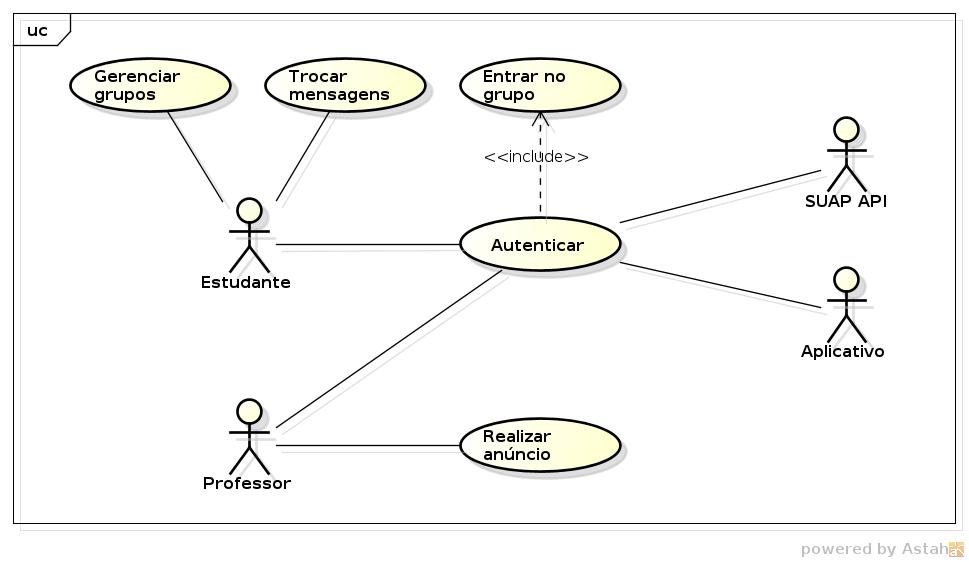

# IFRN Messenger

Aplicativo de troca de mensagens para conectar estudantes do IFRN.

## Requerimentos

#### Autenticação e Autorização com SUAP

O aplicativo deve se comunicar através da API do SUAP para realizar
a autenticação e autorização baseado nas credenciais do estudante ou professor.

#### Grupos Automáticos

O aplicativo deve saber as turmas do estudante conectado e criar um grupo para
cada turma, curso, diretoria e campus. O estudante deve ser capaz de desativar grupos
que não queira participar.

#### Troca de mensagens de texto¹

O aplicativo deve permitir a troca de mensagens de texto em tempo real.

_[1] Mensagens com anexos são um plano futuro que não entram no escopo do projeto atual._

#### Anúncio do Professor

O aplicativo deve permitir que professores emitam um anúncio para suas turmas do semestre atual.
O anúncio do professor deve ser destacado no grupo de turma.

## Casos de Uso

- **Autenticar** - O estudante ou professor acessa o aplicativo pelo primeira vez e informa as credenciais do SUAP, o aplicativo então realiza a consulta na API do SUAP para validar a autenticação.
- **Entrar no grupo** - Uma vez autenticado, o aplicativo (se o usuário tiver autorização de estudante) consultará a API do SUAP para adicionar o estudante nos grupos relacionados as suas turmas, seu curso, diretoria e campus.
- **Gerenciar grupos** - Uma vez autenticado, o estudante pode ativar e desativar grupos totalmente (não receber mensagens) ou parcialmente (silenciar notificações).
- **Trocar Mensagens** - Uma vez autenticado, o estudante pode trocar mensagens nos grupos ativos.
- **Realizar anúncio** - Uma vez autenticado, o professor pode realizar anúncios para as turmas que ele é responsável.
